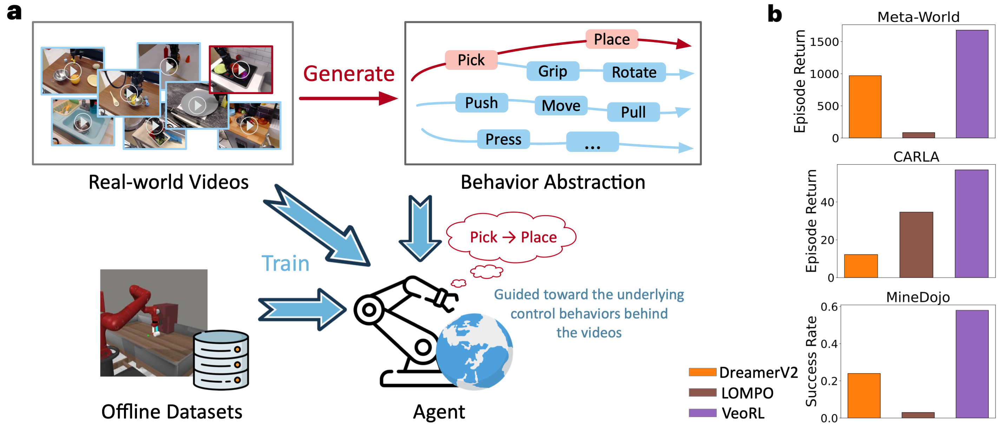

<h1 align="center">
 [ICML 2025] Video-Enhanced Offline Reinforcement Learning: A Model-Based Approach </h1>
<p align="center">
    Minting Pan
    ·
    Yitao Zheng
    ·
    Jiajian Li
    ·
    Yunbo Wang
    ·
    Xiaokang Yang
  </p>

<h3 align="center"> <a href="https://arxiv.org/abs/2505.06482" target="_blank"> Paper </a> &nbsp;&nbsp; | &nbsp;&nbsp; <a href="https://panmt.github.io/VeoRL.github.io/" target="_blank"> Website </a> &nbsp;&nbsp; </h3>
  <div align="center"></div>

<p align="center">

</p>


<p style="text-align:justify">
  Offline reinforcement learning (RL) enables policy optimization using static datasets, avoiding the risks and costs of extensive real-world exploration. However, it struggles with suboptimal offline behaviors and inaccurate value estimation due to the lack of environmental interaction. We present Video-Enhanced Offline RL (VeoRL), a model-based method that constructs an interactive world model from diverse, unlabeled video data readily available online. Leveraging model-based behavior guidance, our approach transfers commonsense knowledge of control policy and physical dynamics from natural videos to the RL agent within the target domain. VeoRL achieves substantial performance gains (over 100% in some cases) across visual control tasks in robotic manipulation, autonomous driving, and open-world video games.
</p>


## Setting up

#### Meta-World
```
conda env create -f set_up/metaworld.yaml
```

#### CARLA

1. Create an environment
```
conda env create -f set_up/carla.yaml
```

2. Download and setup CARLA 0.9.10
```
chmod +x set_up/setup_carla.sh
./setup_carla.sh
```

3. Add to your python path:
```
export PYTHONPATH=$PYTHONPATH:/home/CARLA_0.9.10/PythonAPI
export PYTHONPATH=$PYTHONPATH:/home/CARLA_0.9.10/PythonAPI/carla
export PYTHONPATH=$PYTHONPATH:/home/CARLA_0.9.10/PythonAPI/carla/dist/carla-0.9.10-py3.7-linux-x86_64.egg
```
4. merge the directories, i.e., put 'carla_env_dream.py' into 'CARLA_0.9.10/PythonAPI/carla/agents/navigation/'.

#### MineDojo

1. Create an environment
```
conda create -n minedojo python=3.9
conda activate minedojo 
```

2. Install Java: JDK `1.8.0_171`. Then install the [MineDojo](https://github.com/MineDojo/MineDojo) environment and [MineCLIP](https://github.com/MineDojo/MineCLIP) following their official documents. 

3. Install dependencies
    ```
    pip install -r set_up/requirements.txt
    ```

4. Download the MineCLIP weight [here](https://drive.google.com/file/d/1uaZM1ZLBz2dZWcn85rZmjP7LV6Sg5PZW/view?usp=sharing) and place them at `./weights/mineclip_attn.pth`.

## Training

#### Meta-World:

```
python dreamer.py --logdir path/to/log --config defaults metaworld --task metaworld_handle_press  --target_dataset_logdir path/to/offline_dataset --source_video_logdir path/to/video 
```

#### CARLA

Terminal 1:
```
cd CARLA_0.9.10
bash CarlaUE4.sh -fps 20 -opengl
```

Terminal 2:
```
python dreamer.py --logdir path/to/log --config defaults carla  --target_dataset_logdir path/to/offline_dataset --source_video_logdir path/to/video 
```

When running other environments where the CARLA simulator is not deployed, it may be necessary to comment out the line 'from agents.navigation.carla_env_dreamer import CarlaEnv' in the dreamer.py file.

#### MineDojo

```
python dreamer.py --logdir path/to/log --config defaults minedojo --task minedojo_dv2_harvest_log_in_plains  --target_dataset_logdir path/to/offline_dataset --source_video_logdir path/to/video 
```


## Pretrained Weights

<!-- We provide pretrained weights of **VeoRL** for the tasks mentioned in the paper. You can download them using the links in the table below: 

<div align="center">

| Task Name                  | Weight File                                                                                   |
|----------------------------|-----------------------------------------------------------------------------------------------|
| MetaWorld_Drawer_Open      | [latest_drawer_open.pt]()                                                                |
| MetaWorld_Handle_Press      | [latest_handle_press.pt]()                                                                |
| MetaWorld_Handle_Pull      | [latest_handle_pull.pt]()                                                                |
| MetaWorld_Plate_Slide      | [latest_plate_slide.pt]()                                                                |
| MetaWorld_Coffee_Push      | [latest_coffee_push.pt]()                                                                |
| MetaWorld_Butten_Press      | [latest_butten_press.pt]()                                                                |
| CARLA      | [latest_carla.pt]()                                                                |
| MineDojo_harvest_log_in_plains      | [latest_log.pt]()                                                                |
| MineDojo_harvest_water_with_bucket  | [latest_water.pt]()                                                              |
| MineDojo_harvest_sand               | [latest_sand.pt]()                                                               |
</div> -->

We will release them soon.

## Video Data

We will release them soon.

## Citation
If you find this repo useful, please cite our paper:
```bib
    @inproceedings{pan2025veorl,
        title={Video-Enhanced Offline Reinforcement Learning: A Model-Based Approach},
        author={Minting Pan and Yitao Zheng and Jiajian Li and Yunbo Wang and Xiaokang Yang},
        booktitle={ICML},
        year={2025}
    }
```


## Credits
The codes refer to the implemention of [dreamer-torch](https://github.com/jsikyoon/dreamer-torch). Thanks for the authors！
